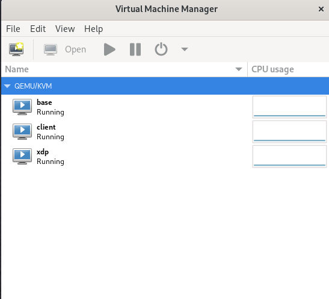

# Terraform Infrastructure Setup for KVM VMs

## Overview

**Terraform** is an open-source infrastructure as code (IaC) tool that allows you to define and provision infrastructure using declarative scripts. The core lifecycle commands of Terraform are:

- `init`: Initialize a new or existing Terraform configuration.
- `plan`: Create an execution plan.
- `apply`: Apply the changes required to reach the desired state of the configuration.
- `destroy`: Destroys everything you provisioned.

In this guide, we will use Terraform to create three KVM virtual machines (VMs): `base`, `client`, and `xdp`.

- **Base**: This is the base QEWU server VM.
- **XDP**: This is the base VM with XDP (eBPF program) loaded.
- **Client**: This VM will be used to measure the throughput of the `base` and `xdp` VMs.

For simplicity, the `.img` files for the VMs will initially be the same as the Ubuntu 24.04 Server Cloud Image.

Here’s a brief overview of what each VM will represent:

- **`base_root.img`**: Image for the `base` VM.
- **`xdp_root.img`**: Image for the `xdp` VM.
- **`client_root.img`**: Image for the `client` VM.

## Downloading the Base Cloud Image

First, download the base cloud image `.img` file from the official Ubuntu cloud image repository:

[Download Ubuntu 24.04 Server Cloud Image](https://cloud-images.ubuntu.com/releases/24.04/release/ubuntu-24.04-server-cloudimg-amd64.img)

Store the downloaded image in the `images/` directory.

## Directory Structure

Here is the directory structure for your Terraform configuration:

```plaintext
.
├── cloudinit_base_template.tf
├── cloudinit_base.tf
├── cloudinit_client.tf
├── cloudinit_xdp.tf
├── common_domain.tf
├── images
│   ├── base_root.img
│   ├── client_root.img
│   ├── ubuntu-24.04-server-cloudimg-amd64.img
│   └── xdp_root.img
├── main.tf
├── providers.tf
├── terraform.tfvars
└── variables.tf
```

# `cloudinit_base_template.tf`

```hcl
data "template_file" "cloudinit_template" {
  template = <<EOF
#cloud-config
fqdn: ${var.vm_domain}
manage_etc_hosts: true
package_update: true
package_upgrade: true
ssh_pwauth: 1
timezone: "America/New_York"
users:
 - name: user
   passwd: $y$j9T$90KTrNAm1VThpSJR99lD/1$V28A3c/tiTBCC1drC6jnu4LVChD1XpcLA2uQ.RD6uXB
   home: /home/user
   shell: /bin/bash
   sudo: ALL=(ALL) NOPASSWD:ALL
   lock_passwd: false
   chpasswd: { expire: False }
   groups: sudo, users, admin
EOF

  vars = {
    fqdn = var.vm_domain
  }
}
```


# `cloudinit_base.tf`

```hcl
data "template_file" "cloudinit_base" {
  template = data.template_file.cloudinit_template.rendered
  vars = {
    fqdn = "base.${var.vm_domain}"
  }
```


# `cloudinit_xdp.tf`

```hcl
data "template_file" "cloudinit_xdp" {
  template = data.template_file.cloudinit_template.rendered
  vars = {
    fqdn = "xdp.${var.vm_domain}"
  }
}
```


# `cloudinit_client.tf`

```hcl
data "template_file" "cloudinit_client" {
  template = data.template_file.cloudinit_template.rendered
  vars = {
    fqdn = "client.${var.vm_domain}"
  }
}
```

# `common_domain.tf`

```hcl
# common_domain.tf


locals {
  common_memory_vcpu = {
    memory = var.vm_memory
    vcpu   = var.vm_vcpu
  }


  common_console = [
    {
      type        = "pty"
      target_port = "0"
      target_type = "serial"
    },
    {
      type        = "pty"
      target_type = "virtio"
      target_port = "1"
    }
  ]


  common_graphics = {
    type        = "spice"
    listen_type = "address"
    autoport    = true
  }
}
```

# `providers.tf`

```hcl
# Define Terraform configuration requirements and providers
terraform {
  required_version = ">= 1.9.2"


  required_providers {
    random = {
      source  = "hashicorp/random"
      # version = "~> 3.6.1" # Allows any version >= 3.6.1 and < 3.7.0
      version = "~> 3.6.1" # Use the latest patch version of 3.6.x
    }
    libvirt = {
      source  = "dmacvicar/libvirt"
      version = "~> 0.7.6" # Use the latest patch version of 0.7.x
    }
  }


  # Optional: Configure backend for state storage
  # backend "s3" {
  #   bucket         = "my-tf-state"
  #   key            = "terraform/state"
  #   region         = "us-east-1"
  # }
}
```

# `terraform.tfvars`

```hcl
# terraform.tfvars is a file where you provide values for the variables defined in variables.tf.
# This file is used to set or override the default values of variables.


# Purpose
# Assign Values: You use terraform.tfvars to assign actual values to the variables that were declared in variables.tf.
# Override Defaults: If a variable has a default value in variables.tf, the value in terraform.tfvars will override it.
# Provide Environment-Specific Configurations: You can use this file to specify different values
# for different environments or scenarios.


# VM Configurations
vms = {
  client = {
    hostname = "client"
    vm_ip     = ["192.168.100.2"]
  },
  base = {
    hostname = "base"
    vm_ip     = ["192.168.100.3"]
  },
  xdp = {
    hostname = "xdp"
    vm_ip     = ["192.168.100.4"]
  },
}


# Node Configuration Parameters
vm_vcpu      = 2
vm_memory    = 4096  # Memory in MiB
vm_disksize  = 40    # Disk size in GiB
vm_domain    = "local"


# VM Image Paths
vm_baseimage = "images/ubuntu-24.04-server-cloudimg-amd64.img"
client_image = "images/client_root.img"
base_image   = "images/base_root.img"
xdp_image     = "images/xdp_root.img"


# Host Parameters
libvirt_disk_path = "/var/lib/libvirt/images/kernel_absorb"
```

# `variables.tf`

```hcl
# variables.tf is a Terraform configuration file where you define variables that will be used throughout
# your Terraform configuration. This file contains variable declarations, including descriptions,
# types, and default values.


# Purpose
# Declare Variables: You use variables.tf to declare what variables your Terraform configuration requires.
# Provide Defaults: You can specify default values for variables, which will be used if no other value is provided.
# Describe Variables: You can include descriptions to explain what each variable is for, which helps with
# documentation and clarity.


# Host Parameters
variable "libvirt_disk_path" {
  description = "Path for the libvirt pool"
  type        = string
  default     = "/var/lib/libvirt/images/kernel_absorb"
}


# Node Config
variable "vm_baseimage" {
  description = "Path to the Ubuntu 24.04 base image"
  type        = string
  default     = "images/ubuntu-24.04-server-cloudimg-amd64.img"
}


variable "client_image" {
  description = "Path to the client VM image"
  type        = string
  default     = "images/client_root.img"
}


variable "base_image" {
  description = "Path to the base VM image"
  type        = string
  default     = "images/base_root.img"
}


variable "xdp_image" {
  description = "Path to the XDP VM image"
  type        = string
  default     = "images/xdp_root.img"
}


variable "vm_vcpu" {
  description = "Number of vCPUs for each VM"
  type        = number
  default     = 2
}


variable "vm_memory" {
  description = "Memory in MiB for each VM"
  type        = number
  default     = 4096
}


variable "vm_disksize" {
  description = "Disk size in GiB for each VM"
  type        = number
  default     = 40
}


variable "vm_domain" {
  description = "FQDN for the network"
  type        = string
  default     = "local"
}


# VMs
variable "vms" {
  description = "Map of VM configurations"
  type = map(object({
    hostname = string
    vm_ip    = list(string)
  }))
}
```

# `main.tf`

```hcl
provider "libvirt" {
  uri = "qemu:///system"
}


resource "libvirt_pool" "kernel_absorb_pool" {
  name = "kernel_absorb_pool"
  type = "dir"
  path = var.libvirt_disk_path
}


# this denotes official cloud .img file
resource "libvirt_volume" "ubuntu_24_base" {
  name   = "ubuntu_24.04"
  pool   = libvirt_pool.kernel_absorb_pool.name
  format = "qcow2"
  source = var.vm_baseimage
}


# client VM storage volume
resource "libvirt_volume" "qcow2_client" {
  name   = "client_root.img"
  pool   = libvirt_pool.kernel_absorb_pool.name
  format = "qcow2"
  source = var.client_image
}


# base server VM storage volume
resource "libvirt_volume" "qcow2_base" {
  name   = "base_root.img"
  pool   = libvirt_pool.kernel_absorb_pool.name
  format = "qcow2"
  source = var.base_image
}


# xdp server VM storage volume
resource "libvirt_volume" "qcow2_xdp" {
  name   = "xdp_root.img"
  pool   = libvirt_pool.kernel_absorb_pool.name
  format = "qcow2"
  source = var.xdp_image
}


resource "libvirt_cloudinit_disk" "cloudinit_client" {
  name      = "cloudinit_client.iso"
  pool      = libvirt_pool.kernel_absorb_pool.name
  user_data = data.template_file.cloudinit_client.rendered
}


resource "libvirt_cloudinit_disk" "cloudinit_base" {
  name      = "cloudinit_base.iso"
  pool      = libvirt_pool.kernel_absorb_pool.name
  user_data = data.template_file.cloudinit_base.rendered
}


resource "libvirt_cloudinit_disk" "cloudinit_xdp" {
  name      = "cloudinit_xdp.iso"
  pool      = libvirt_pool.kernel_absorb_pool.name
  user_data = data.template_file.cloudinit_xdp.rendered
}


# see https://github.com/dmacvicar/terraform_provider_libvirt/blob/v0.7.6/website/docs/r/network.markdown
resource "libvirt_network" "net" {
  name   = "net"
  mode   = "nat"
  domain = var.vm_domain
  addresses = ["192.168.100.0/24"]
  dhcp {
    enabled = false
  }
  dns {
    enabled    = true
    local_only = false
  }
}


resource "libvirt_domain" "domain_client" {
  name   = var.vms["client"].hostname


  cloudinit = libvirt_cloudinit_disk.cloudinit_client.id


  network_interface {
    network_name   = "net"
    wait_for_lease = true
    hostname       = var.vms["client"].hostname
    addresses = var.vms["client"].vm_ip
  }


  disk {
    volume_id = libvirt_volume.qcow2_client.id
  }


  # common part
  memory = local.common_memory_vcpu.memory
  vcpu   = local.common_memory_vcpu.vcpu


  dynamic "console" {
    for_each = local.common_console
    content {
      type        = console.value.type
      target_port = console.value.target_port
      target_type = console.value.target_type
    }
  }


  graphics {
    type        = local.common_graphics.type
    listen_type = local.common_graphics.listen_type
    autoport    = local.common_graphics.autoport
  }


}


resource "libvirt_domain" "domain_base" {
  name   = var.vms["base"].hostname


  cloudinit = libvirt_cloudinit_disk.cloudinit_base.id


  network_interface {
    network_name   = "net"
    wait_for_lease = true
    hostname       = var.vms["base"].hostname
    addresses = var.vms["base"].vm_ip
  }


  disk {
    volume_id = libvirt_volume.qcow2_base.id
  }


  # common part
  memory = local.common_memory_vcpu.memory
  vcpu   = local.common_memory_vcpu.vcpu


  dynamic "console" {
    for_each = local.common_console
    content {
      type        = console.value.type
      target_port = console.value.target_port
      target_type = console.value.target_type
    }
  }


  graphics {
    type        = local.common_graphics.type
    listen_type = local.common_graphics.listen_type
    autoport    = local.common_graphics.autoport
  }


}


resource "libvirt_domain" "domain_xdp" {
  name   = var.vms["xdp"].hostname


  cloudinit = libvirt_cloudinit_disk.cloudinit_xdp.id


  network_interface {
    network_name   = "net"
    wait_for_lease = true
    hostname       = var.vms["xdp"].hostname
    addresses = var.vms["xdp"].vm_ip
  }


  disk {
    volume_id = libvirt_volume.qcow2_xdp.id
  }


  # common part
  memory = local.common_memory_vcpu.memory
  vcpu   = local.common_memory_vcpu.vcpu


  dynamic "console" {
    for_each = local.common_console
    content {
      type        = console.value.type
      target_port = console.value.target_port
      target_type = console.value.target_type
    }
  }


  graphics {
    type        = local.common_graphics.type
    listen_type = local.common_graphics.listen_type
    autoport    = local.common_graphics.autoport
  }


}

```


# `images/`

```c
upgautamvt@fedora:~/CLionProjects/KernelWithBpfPrograms/benchmarks/macrobenchmarks/terraform/xdp_terraform$ ls images/
base_root.img  client_root.img  ubuntu-24.04-server-cloudimg-amd64.img  xdp_root.img

```

After `terraform apply plan`


Refer to: https://github.com/upgautamvt/KernelWithBpfPrograms/tree/main/benchmarks/macrobenchmarks/terraform/xdp_terraform
